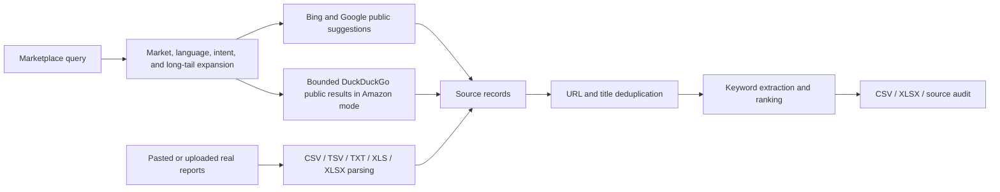
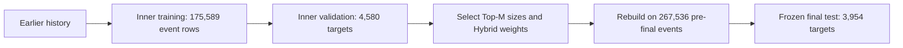

# Architecture — E-commerce Search & Recommendation Platform

This repository contains two independently runnable subsystems with a shared search-and-recommendation vocabulary. The Marketplace application gathers and ranks keyword evidence. The RecSys benchmark evaluates candidate retrieval and recommendation ranking on deterministic synthetic behavior. They do not share live production data.

## Marketplace ingestion



`api/marketplace-collect.js` expands the submitted phrase with market-aware seed variants and intent modifiers. It sends bounded requests with concurrency 8 and a 4.5-second timeout. Records retain the originating query, provider, URL, region, language, and source type so downstream terms remain auditable.

The implementation supports US, UK, Canada, Australia, Germany, and several Spanish-language market options. Locale settings are propagated to suggestion providers; explicit Spanish variants exist for common product phrases. TikTok Shop mode uses public suggestions. Its direct page and general-search limits are currently zero, so it is not a broad TikTok crawler.

## Keyword extraction

The browser normalizes collected titles, snippets, suggestions, pasted content, and uploaded report text. It extracts:

- normalized word tokens and 2–4 word phrases;
- hashtags;
- 2–4 character Chinese sequences;
- terms that arrive with real report measurements.

Rules classify candidates into roles such as core keyword, audience, material, specification, variant, use case, functional feature, pain point, content scene, hashtag, and uploaded-report term. These labels are transparent heuristics, not predictions from an NLP model.

## Keyword ranking

The feature-based `Weight` score combines log-scaled observed frequency (up to 45 points), source-query coverage (up to 15), source-type coverage (up to 10), real uploaded trend heat when available (up to 15), and smaller category/intent and long-tail-specificity contributions. The result is capped to 1–100; ties use observed count and lexical order.

`Weight` is an internal priority score. It is not search volume, official platform heat, GMV, sales, review count, or growth. Those measurements remain absent unless supplied by a real uploaded report.

## Recommendation data generation

The RecSys module creates a deterministic seed-2027 catalog, user population, sessions, experiment assignment, and implicit-feedback stream. Events follow view → click → add-to-cart → purchase ordering and receive training weights 1, 2, 4, and 6. Product metadata contains synthetic title, category, subcategory, keywords, tags, price bucket, use case, audience, and attributes.

The offline recommender benchmark uses synthetic product metadata modeled after the Marketplace Agent's keyword/category feature schema; live marketplace data is not used in the reported recommendation metrics.

## Temporal split



The inner temporal target is each eligible user's later unseen product before the final cutoff. It is used only to choose candidate sizes and Hybrid weights. The frozen final target occurs later and is not accepted as input by the tuning function. Models are rebuilt on all pre-final history after selection.

Tests confirm that targets do not occur in their users' training histories, validation and final user-product pairs are disjoint, target timestamps fall on the correct side of each cutoff, and all four models share the same final population and target checksum.

## Candidate retrieval

Three sources build candidates from training data only:

1. **Collaborative:** log-scaled sparse user-item histories and item-item cosine similarity retrieve Top-100 products.
2. **Content:** TF-IDF product vectors and normalized weighted user profiles retrieve Top-100 products. Singleton terms are excluded so a unique synthetic token cannot act as an item identifier.
3. **Popularity:** global pre-cutoff interaction weight contributes a Top-10 fallback list.

Every source filters products already seen by the user. Candidate lists are deduplicated into a union while retaining each component's raw score and source membership.

## Hybrid ranking

For each user and component, finite scores over the candidate union are min-max normalized. Missing and zero-variance component scores become zero. The selected score is:

```text
Hybrid = 0.6 × Collaborative + 0.1 × Content + 0.3 × Popularity
```

The configuration was selected from a deterministic 198-row inner-validation grid and stored in `recsys/results/hybrid_config.json`. Candidate membership is separate from ranking: a source may enlarge the union even when its normalized weighted score is small.

## Offline evaluation

The final evaluator computes Recall@5/10, Precision@5/10, NDCG@5/10, and catalog Coverage@10 against one unseen target per eligible user. Per-user outcomes support paired comparisons. Phase 4 reconstructs every published aggregate, bootstraps Hybrid-minus-Collaborative differences, applies exact McNemar tests to hit metrics and paired sign-flip randomization to NDCG, and audits sparse-history, category, retrieval, ranking, and component behavior.

The A/B module is separate from recommender evaluation. It uses deterministic user-level control/treatment assignment and a two-proportion test on whether each user purchased at least once.

## APIs

The Node server and Vercel configuration expose:

- `POST /api/marketplace-collect` for expanded public-source collection;
- `POST /api/parse-upload` for auditable XLSX-to-text conversion;
- `POST /api/export-keyword-xlsx` for multi-sheet workbook export.

`collector-server.js` also serves `index.html`, `app.js`, and `styles.css`. Optional image/video experiment endpoints remain in the repository but are outside the benchmark and primary architecture.

## Data provenance

| Data | Provenance | Used in reported RecSys metrics? |
|---|---|---:|
| Marketplace suggestions | Public Bing/Google suggestions and bounded public search evidence | No |
| User-uploaded reports | User-provided local report content | No |
| Product metadata | Deterministic synthetic generator | Yes |
| Sessions and events | Deterministic synthetic generator | Yes |
| A/B assignment and outcome | Deterministic synthetic generator | Separate experiment |

Small result CSV/JSON files are retained for inspection. Large raw synthetic files and the SQLite database are reproducible and ignored by Git.

## Known limitations

- Public-source terms are discovery evidence, not official Amazon or TikTok measurements.
- Marketplace ranking is heuristic and feature-based, not learned-to-rank.
- Recommendation and A/B data are synthetic; reported recommendation results are offline.
- The benchmark has one seeded catalog and behavior distribution, so external validity is unknown.
- Every final target user has at least three historical products; the project does not evaluate true new-user cold start.
- Hybrid mean gains over Collaborative are small and are not statistically established at the 0.05 level overall.
- There is no live recommendation endpoint, production traffic, distributed trainer, online feature store, or online recommender experiment.
