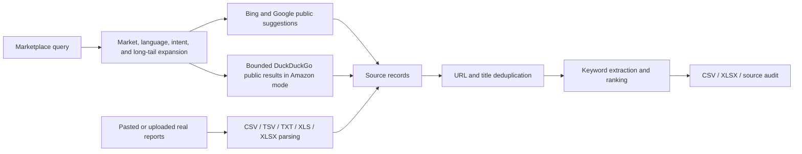

# Architecture — E-commerce Search & Recommendation Platform

This repository contains three independently runnable subsystems with a shared search-and-recommendation vocabulary. The Marketplace application gathers and ranks keyword evidence. The RecSys benchmark evaluates candidate retrieval and recommendation ranking on deterministic synthetic behavior. The multimodal module evaluates pretrained image/text product retrieval using real public ABO catalog data. They do not share live production data or benchmark outcomes.

## Marketplace ingestion



`api/marketplace-collect.js` expands the submitted phrase with market-aware seed variants and intent modifiers. It sends bounded requests with concurrency 8 and a 4.5-second timeout. Records retain the originating query, provider, URL, region, language, and source type so downstream terms remain auditable.

The implementation supports US, UK, Canada, Australia, Germany, and several Spanish-language market options. Locale settings are propagated to suggestion providers; explicit Spanish variants exist for common product phrases. TikTok Shop mode uses public suggestions. Its direct page and general-search limits are currently zero, so it is not a broad TikTok crawler.

## Keyword extraction

The browser normalizes collected titles, snippets, suggestions, pasted content, and uploaded report text. It extracts:

- normalized word tokens and 2–4 word phrases;
- hashtags;
- 2–4 character Chinese sequences;
- terms that arrive with real report measurements.

Rules classify candidates into roles such as core keyword, audience, material, specification, variant, use case, functional feature, pain point, content scene, hashtag, and uploaded-report term. These labels are transparent heuristics, not predictions from an NLP model.

## Keyword ranking

The feature-based `Weight` score combines log-scaled observed frequency (up to 45 points), source-query coverage (up to 15), source-type coverage (up to 10), real uploaded trend heat when available (up to 15), and smaller category/intent and long-tail-specificity contributions. The result is capped to 1–100; ties use observed count and lexical order.

`Weight` is an internal priority score. It is not search volume, official platform heat, GMV, sales, review count, or growth. Those measurements remain absent unless supplied by a real uploaded report.

## Recommendation data generation

The RecSys module creates a deterministic seed-2027 catalog, user population, sessions, experiment assignment, and implicit-feedback stream. Events follow view → click → add-to-cart → purchase ordering and receive training weights 1, 2, 4, and 6. Product metadata contains synthetic title, category, subcategory, keywords, tags, price bucket, use case, audience, and attributes.

The offline recommender benchmark uses synthetic product metadata modeled after the Marketplace Agent's keyword/category feature schema; live marketplace data is not used in the reported recommendation metrics.

## Temporal split


The inner temporal target is each eligible user's later unseen product before the final cutoff. It is used only to choose candidate sizes and Hybrid weights. The frozen final target occurs later and is not accepted as input by the tuning function. Models are rebuilt on all pre-final history after selection.

Tests confirm that targets do not occur in their users' training histories, validation and final user-product pairs are disjoint, target timestamps fall on the correct side of each cutoff, and all four models share the same final population and target checksum.

## Candidate retrieval

Three sources build candidates from training data only:

1. **Collaborative:** log-scaled sparse user-item histories and item-item cosine similarity retrieve Top-100 products.
2. **Content:** TF-IDF product vectors and normalized weighted user profiles retrieve Top-100 products. Singleton terms are excluded so a unique synthetic token cannot act as an item identifier.
3. **Popularity:** global pre-cutoff interaction weight contributes a Top-10 fallback list.

Every source filters products already seen by the user. Candidate lists are deduplicated into a union while retaining each component's raw score and source membership.

## Hybrid ranking

For each user and component, finite scores over the candidate union are min-max normalized. Missing and zero-variance component scores become zero. The selected score is:

```text
Hybrid = 0.6 × Collaborative + 0.1 × Content + 0.3 × Popularity
```

The configuration was selected from a deterministic 198-row inner-validation grid and stored in `recsys/results/hybrid_config.json`. Candidate membership is separate from ranking: a source may enlarge the union even when its normalized weighted score is small.

## Offline evaluation

The final evaluator computes Recall@5/10, Precision@5/10, NDCG@5/10, and catalog Coverage@10 against one unseen target per eligible user. Per-user outcomes support paired comparisons. Phase 4 reconstructs every published aggregate, bootstraps Hybrid-minus-Collaborative differences, applies exact McNemar tests to hit metrics and paired sign-flip randomization to NDCG, and audits sparse-history, category, retrieval, ranking, and component behavior.

The A/B module is separate from recommender evaluation. It uses deterministic user-level control/treatment assignment and a two-proportion test on whether each user purchased at least once.

## APIs

The Node server and Vercel configuration expose:

- `POST /api/marketplace-collect` for expanded public-source collection;
- `POST /api/parse-upload` for auditable XLSX-to-text conversion;
- `POST /api/export-keyword-xlsx` for multi-sheet workbook export.

`collector-server.js` also serves `index.html`, `app.js`, and `styles.css`. Optional image/video experiment endpoints remain in the repository but are outside the benchmark and primary architecture.

## Data provenance

| Data | Provenance | Used in reported RecSys metrics? |
|---|---|---:|
| Marketplace suggestions | Public Bing/Google suggestions and bounded public search evidence | No |
| User-uploaded reports | User-provided local report content | No |
| Product metadata | Deterministic synthetic generator | Yes |
| Sessions and events | Deterministic synthetic generator | Yes |
| A/B assignment and outcome | Deterministic synthetic generator | Separate experiment |
| ABO product images and metadata | Public Amazon Berkeley Objects research dataset | No; separate multimodal retrieval benchmark |

Small result CSV/JSON files are retained for inspection. Large raw synthetic files and the SQLite database are reproducible and ignored by Git.

## Known limitations

- Public-source terms are discovery evidence, not official Amazon or TikTok measurements.
- Marketplace ranking is heuristic and feature-based, not learned-to-rank.
- Recommendation and A/B data are synthetic; reported recommendation results are offline.
- The benchmark has one seeded catalog and behavior distribution, so external validity is unknown.
- Every final target user has at least three historical products; the project does not evaluate true new-user cold start.
- Hybrid mean gains over Collaborative are small and are not statistically established at the 0.05 level overall.
- There is no live recommendation endpoint, production traffic, distributed trainer, online feature store, or online recommender experiment.

## Multimodal Product Retrieval

The implemented `multimodal/` MVP is independent of the historical synthetic
behavioral pipeline. It adds public ABO catalog ingestion, pinned pretrained
SigLIP2 inference, exact image-vector search, BM25, and RRF.

```text
Public ABO English listing metadata + selected small catalog images
    ↓ deterministic item selection; identity, byte and pixel checksums
Catalog manifest in product-ID order
    ├─ Indexed image → frozen SigLIP2 image encoder → L2 vectors → content cache
    │                                                        ↓
    │                                    NumPy exact / FAISS IndexFlatIP
    ├─ Distinct, unambiguous alternate view → image query ─────┤
    └─ Type + structured attributes → text query encoder ─────┤
                                                             ↓
                                                    Vector Top-50
Product text metadata → BM25 Top-50 ───────────────────────┐
                                                         ↓
                                              Reciprocal Rank Fusion
                                                         ↓
                                     Top-K + per-query evaluation artifacts
```

The shared image/text representation comes from pretrained weights; no training
or fine-tuning takes place. The model abstraction exposes `encode_text`,
`encode_images`, `encode_image`, model name and embedding dimension. The first
encoder uses the pinned SigLIP2 base checkpoint. All library imports are under
`multimodal.src`; historical RecSys modules are neither imported nor changed.

A persistent local encoder worker isolates PyTorch from FAISS because the tested
macOS wheels otherwise initialize incompatible copies of OpenMP. It communicates
synchronously through private pipes. This is process isolation for local inference,
not distributed serving. Query-inclusive latency includes communication; exact
vector-search latency is recorded separately. CPU works, MPS is used for the main
run, and CUDA selection is implemented but not verified.

Image identity queries exclude any view equal to an indexed image by ID, bytes,
or decoded pixels, and views shared by multiple products in the selected catalog.
Text qrels are all products matching the declared structured attribute conjunction.
No query contains a product/model identifier or a copied full title. These labels
favor lexical retrieval and do not constitute independent human relevance judgments.

All methods share the same query sets, catalog and metric implementation. The
benchmark records Recall, NDCG, MRR, source complementarity, product-type segments,
and explicit latency scopes. Configuration is fixed before scoring, with no
training or tuning. Image holdout does not imply unseen product identities.
`IndexFlatIP` is exact, not ANN; HNSW was left out of the urgent MVP.

The historical retrieval entry point remains `python -m multimodal.src.search`.
Its original benchmark results are unchanged. The grounded agent extension below
adds a separate CLI and local API. See [the module](multimodal/README.md)
and [machine-readable results](multimodal/results/README.md) for implemented facts.

## Agentic Multimodal Product Search

```text
User text + optional image
    ↓ structured OpenAI plan (requested constraints, comparison intent)
Bounded tool dispatcher (maximum 8 calls)
    ├─ Explicit product/category text → existing BM25
    ├─ Attached image → existing SigLIP2 worker + FAISS
    └─ Ambiguous description → existing RRF, or planner-selected vector search
    ↓ actual retrieved product IDs + source/rank/score
filter_products → inspect results → at most one broader lexical retry
    ↓ at most 8 eligible evidence records; get_product inspection
LLM selects up to 3 products and structured field/value citations
    ↓ deterministic ID, field and normalized value checks
compare_products on validated IDs when requested
    ↓ deterministic factual answer rendering + limitations + complete trace
```

`product_evidence.py` projects only populated ABO fields. Dimensions retain their
source units/axis and are normalized to inches; depth explicitly maps to source
length. Missing values fail filters. Material `wood` is a documented family
match for reported wood/ash/pine/bamboo/MDF/hardwood labels, not an assertion of
all-wood construction. Category means the supplied `product_type`, whose quality
is not independently verified. No material or size is inferred from an image or title.

`agent_tools.py` validates tool names, argument sets, types, limits, constraints
and request-scoped candidate IDs before execution. `product_agent.py` performs
the bounded control flow, records every actual call/result/error, and withholds
recommendations after a provider, tool or grounding failure. Tools are local,
synchronous functions; the encoder worker only isolates native runtimes.

`llm_provider.py` uses the existing OpenAI credential convention and a pinned,
configurable hosted model through the Responses API. Strict JSON schemas bound
planning and evidence selection. The cache keys the full prompt, schema, payload,
model and temperature; API latency, cache lookup latency, timestamps, token usage
and response IDs are separate. Credentials are never serialized into traces.

The validator checks all structured product claims against retrieved metadata.
Numerically equivalent dimensions with supported units are canonicalized within
the six-decimal conversion tolerance. Additional free-form answer/reason fields
are rejected. The application writes reasons from accepted citations and computes
width comparisons itself. This guarantees a bounded claim surface; it does not
measure relevance, real-world product truth, or room suitability.

`agent_benchmark.py` evaluates the frozen authored fixtures against independent
expected tool/constraint annotations and original catalog fields. Raw drafts,
rejections, abstentions, denominators and local/API latency are retained. The first
development run remains in `results/agent_v1`; repaired behavior is measured in
`results/agent_v2`. See [measured agent evidence](RESUME_EVIDENCE.md#agentic-multimodal-product-search).

The optional `agent_server.py` exposes `POST /api/agent/search` on loopback port
8067 using the repository's JSON route convention. It accepts a registered ABO
image ID, while the CLI also accepts local image files. This sequential local
service has no browser frontend or production authentication/deployment. The
existing Node server and its endpoints retain their behavior.
